# Cardiovascular Disease Risk Prediction Using Logistic Regression

*Image Source: [Google Images](https://images.app.goo.gl/RcmNZLhfTAZMNHfJ9)*

A logistic regression model to predict the likelihood of an individual developing cardiovascular disease (CVD) in the next 10 years. This project focuses on preprocessing, class imbalance handling, hyperparameter tuning, and evaluating model performance using real-world health data.

## Table of Contents

<ol>
<li><a href="#Overview"><b> Overview </a></b></li>
<li><a href="#Datasets"><b> Datasets </a></b></li>
<li><a href="#EDA"><b> Exploratory Data Analysis </a></b></li>
<li><a href="#featureengineering"><b> Feature Engineering </a></b></li>

</ol>

<h2 id="Overview">1. Overview</h2>
 WHO (World Health Organization) estimates that out of 5 deaths, 4 of them are realted to the cardiovascular disease(CVD), so the goal of this project is to use Logistic Regression to determine the propoertion of patients who are at a high risk of CVD. 

 This project focuses on preprocessing, class imbalance handling, hyperparameter tuning, and evaluating model performance using real-world health data.

<h2 id="Datasets">2. Dataset</h2>
The dataset has a total of: 
 - Rows:  4240  
 - Features:  16

 Target Column: TenYearCHD (1 = Risk of CVD, 0 = No Risk)

#### 2.1 Features used:
- Demographic: male, age
- Health: currentSmoker, cigsPerDay, BPMeds, prevalentStroke, prevalentHyp, diabetes
- Measurements: totChol, sysBP, diaBP, BMI, heartRate, glucose

#### 2.2 Data Cleaning:
- Irrelevant column 'education' has been dropped.
- There were missing values too, here we have dropped it else we could have used imputation or other methods to fill up those missing values but for the shake of this project, we dropped it.

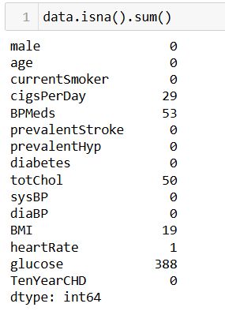

<h2 id="EDA">3. Exploratory Data Analysis</h2>

#### 3.1 Univariate Analysis:
a. Histogram:

To visualize the distribution of a single variable and identify its range, skewness, and presence of outliers.
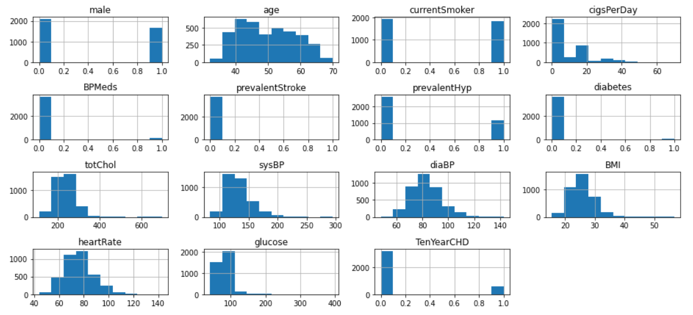

b. Density Plot:

To show the probability distribution of a variable and provide insights into its shape and central tendencies.
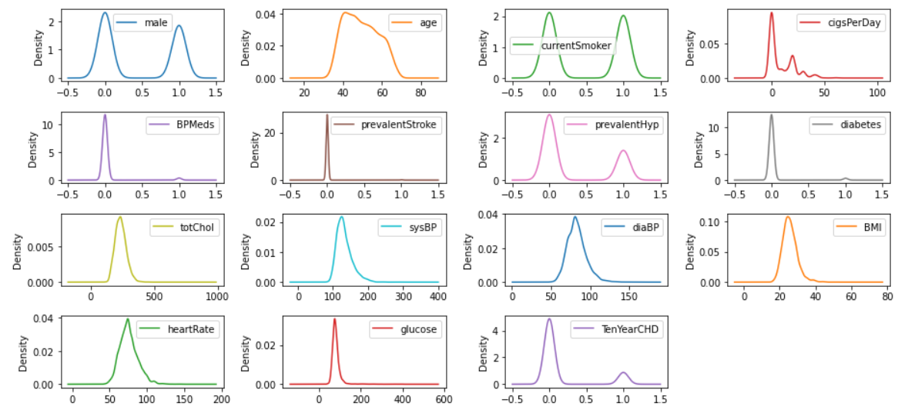

c. Box Plot:

To highlight the spread and variability of a variable, including its median, quartiles, and outliers.
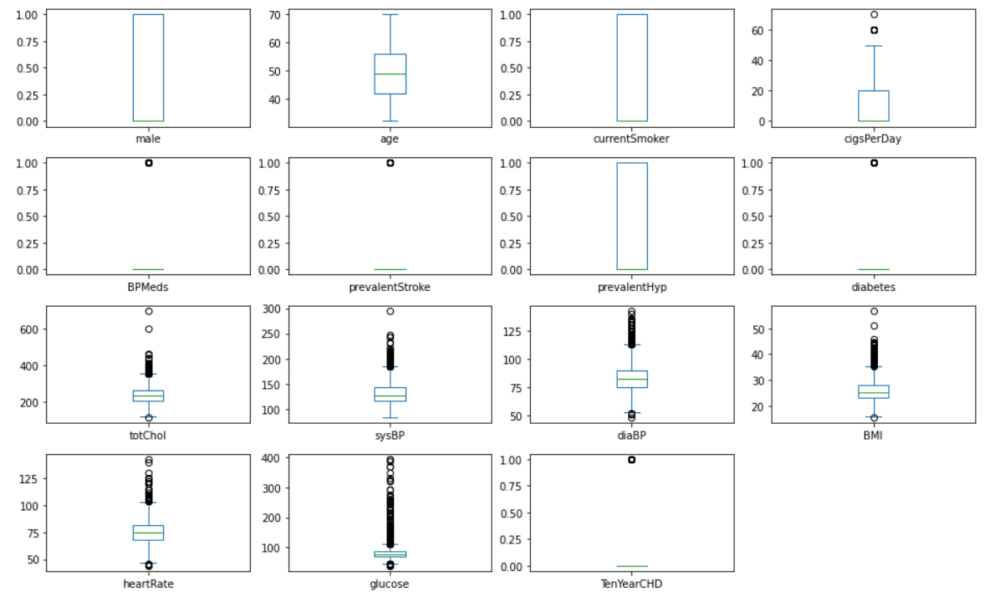

#### 3.2 Multivariate Analysis:
a. Heatmap:

To identify relationships between numerical variables and detect multicollinearity in the data.
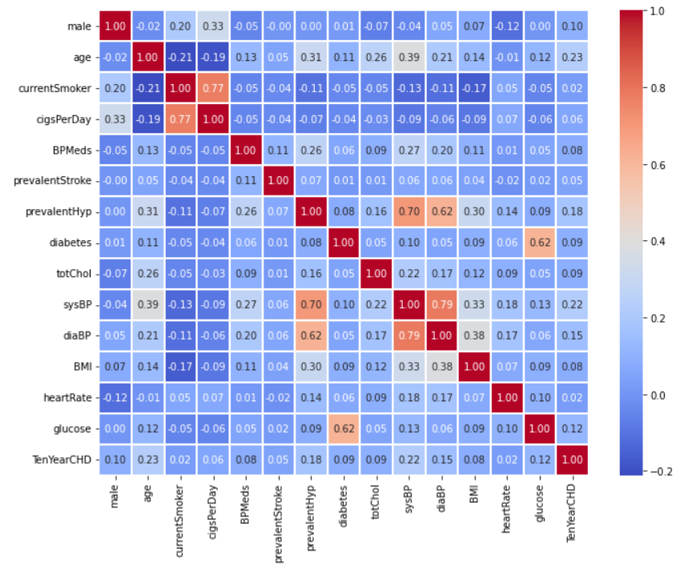

#### 3.3 Checking Class Imbalance:
When working with classification task, it is important to check if the class or the count of the classes of the target feature is balanced or not. For that we can just simple target that column and count the values.
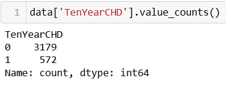

<b> There is a clear case of class imabalance here. </b>

So, now we will use a technique called <b>Resampling </b> and keep it separately and later on test our model on the original imabalanced data and this newly oversampled data and compare the results.

#### 3.4 Handling Class Imbalance:
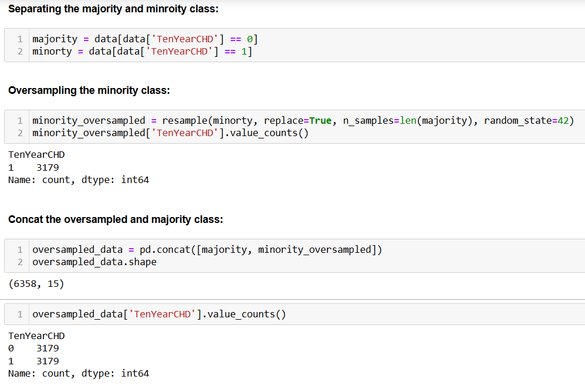

so, the countplot below shows the count of the classes on the original and oversampled data.
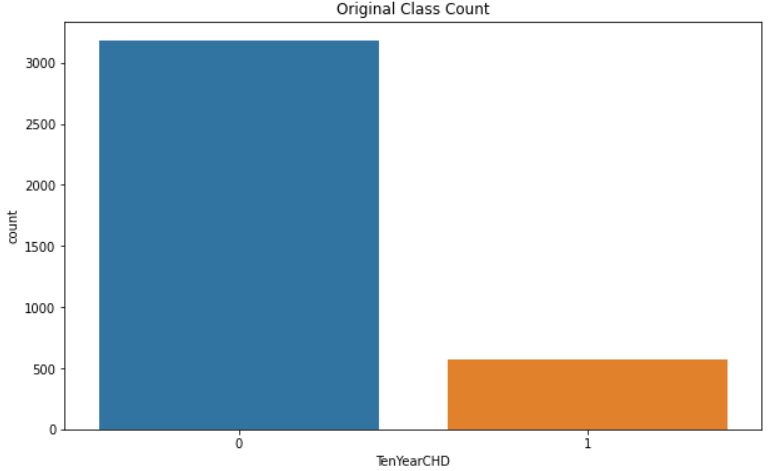

 

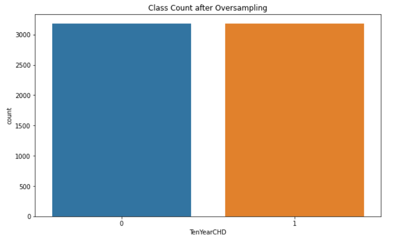

<h2 id="featureengineering">4. Feature Engineering </h2>

Here, first we will use the original dataset and then use the oversampled dataset.

<h3> 4.1 On the original dataset</h3>
1. First we will split the data into training and testing data so that we can use training data to build the model and test data to find the generalization of the model.  

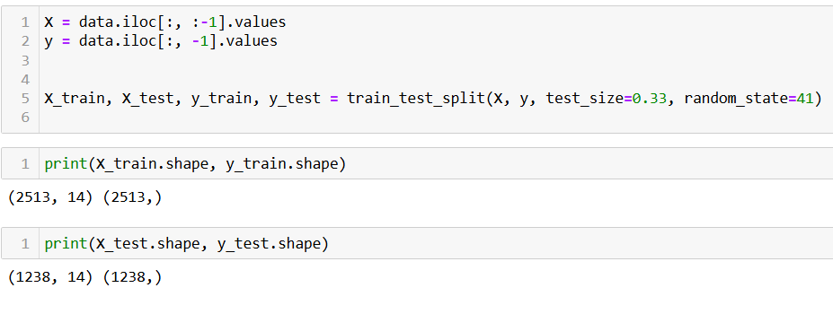
2. We will use a <b>Pipeleine</b> so that it can automate the sequence of preprocessing steps and model training, ensuring consistency and reducing the risk of errors.  
 
<b>NOTE: </b>Here, we have only used 7 as the value for K in SelectKBest just for the testing purpose, later on when optimizing the hyperparameter, we will use differen variations.

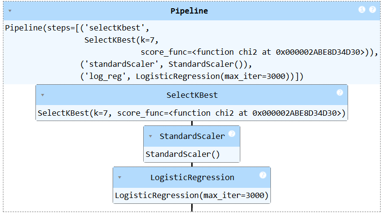

Then we will fit the pipeline on X_train and y_train data. This is the split that we did in the first step on the original oversampled dataset.

Once the model is trained, we will predict on the X_test data and compare the results.  
 
Since we are working with imbalanced dataset, accuracy alone cannot be used as the decision metrics on the generalization. Below is the result of the training and testing data: 

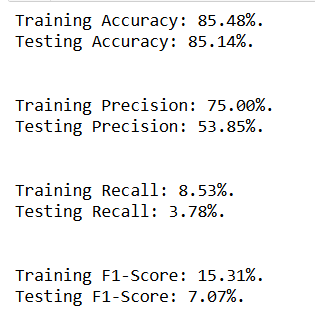

As we can see the accuracy on the training and testing data is quite high but it is not useful, we are looking at F1-Score, which is the generalization of Precision and Recall and are commonly used metrics for imbalanced dataset.

<h3> 4.2 On the oversampled dataset</h3>
- Similarly, we repeat the same process on the oversampled dataset. We will split the oversampled data in training and testing data and fit the model on the training data.

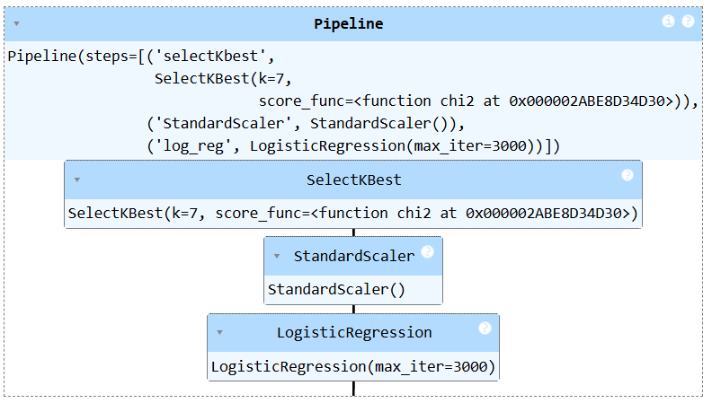

The metrics on the oversampled data:

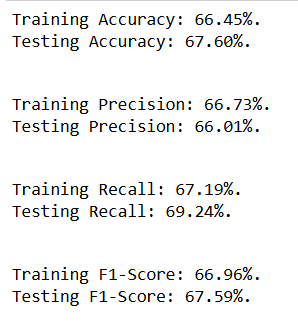

