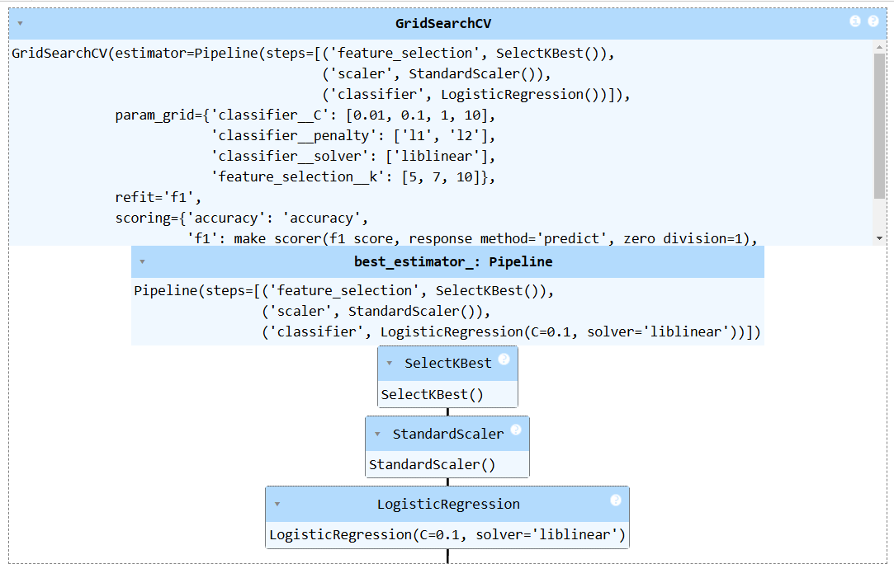

# Cardiovascular Disease Risk Prediction Using Logistic Regression

*Image Source: [Google Images](https://images.app.goo.gl/RcmNZLhfTAZMNHfJ9)*

A logistic regression model to predict the likelihood of an individual developing cardiovascular disease (CVD) in the next 10 years. This project focuses on preprocessing, class imbalance handling, hyperparameter tuning, and evaluating model performance using real-world health data.

## Table of Contents

<ol>
<li><a href="#Overview"><b> Overview </a></b></li>
<li><a href="#Datasets"><b> Datasets </a></b></li>
<li><a href="#EDA"><b> Exploratory Data Analysis </a></b></li>
<li><a href="#overview"><b> Overview </a></b></li>
</ol>

<h2 id="Overview">1. Overview</h2>
 WHO (World Health Organization) estimates that out of 5 deaths, 4 of them are realted to the cardiovascular disease(CVD), so the goal of this project is to use Logistic Regression to determine the propoertion of patients who are at a high risk of CVD. 

 This project focuses on preprocessing, class imbalance handling, hyperparameter tuning, and evaluating model performance using real-world health data.

<h2 id="Datasets">2. Dataset</h2>
The dataset has a total of:
 - Rows: 4240
 - Features: 16

 Target Column: TenYearCHD (1 = Risk of CVD, 0 = No Risk)

#### 2.1 Features used:
- Demographic: male, age
- Health: currentSmoker, cigsPerDay, BPMeds, prevalentStroke, prevalentHyp, diabetes
- Measurements: totChol, sysBP, diaBP, BMI, heartRate, glucose

#### 2.2 Data Cleaning:
- Irrelevant column 'education' has been dropped.
- There were missing values too, here we have dropped it else we could have used imputation or other methods to fill up those missing values but for the shake of this project, we dropped it.

<h2 id="EDA">3. Exploratory Data Analysis</h2>
